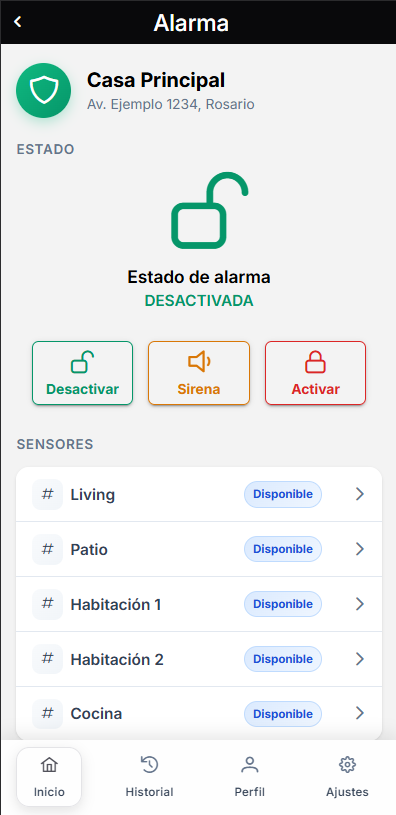
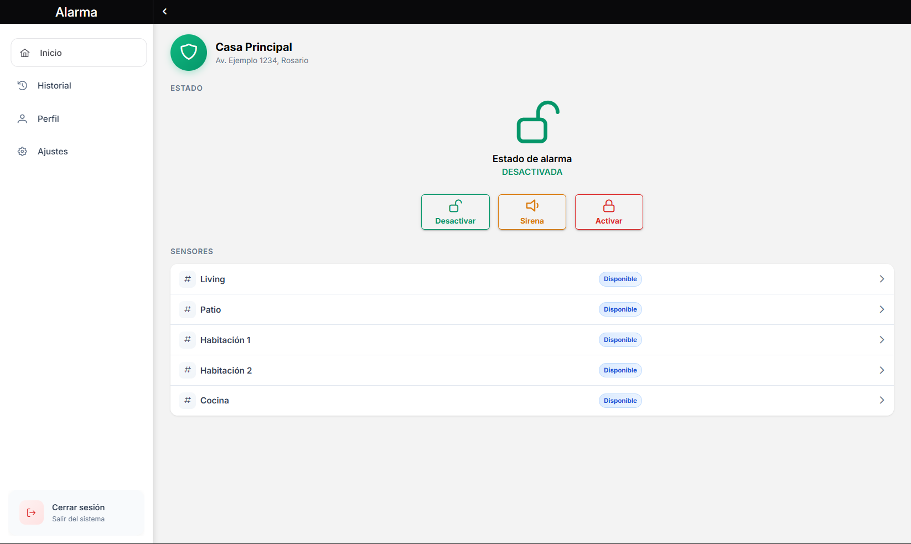
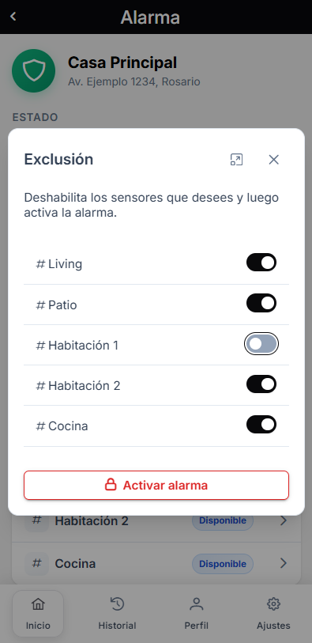
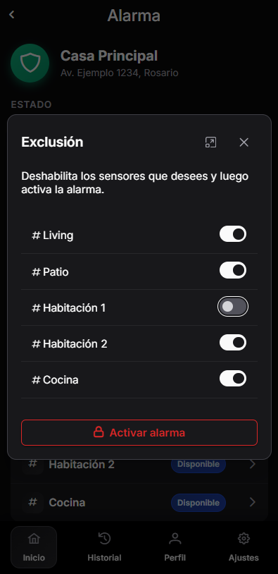
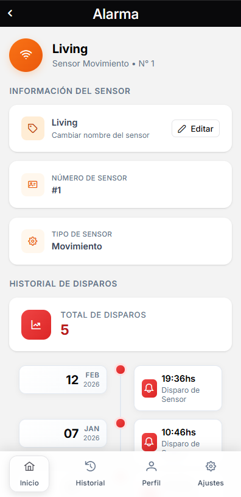
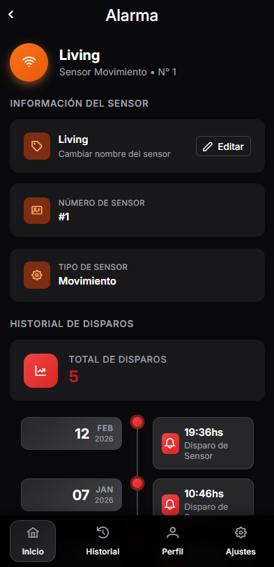

# Sistema de Alarmas IoT

Sistema completo de **alarma domótica inteligente**, diseñado como una solución full stack que permite **monitorear, controlar y gestionar sistemas de seguridad en tiempo real** desde web y dispositivos móviles.

> *Este repositorio actúa como punto de entrada al sistema y centraliza el acceso a sus componentes (frontend y backend).*

El proyecto integra **frontend, backend y comunicación con dispositivos físicos**, utilizando tecnologías modernas y una arquitectura escalable.

## Descripción General

El sistema está pensado para hogares inteligentes, donde los usuarios pueden:

- Controlar el estado de su alarma (activar / desactivar)
- Monitorear sensores en tiempo real
- Recibir notificaciones ante eventos de seguridad
- Gestionar múltiples hogares desde una sola aplicación

La solución combina:

- Interfaces modernas (web + mobile)
- Backend robusto con lógica de negocio
- Comunicación en tiempo real
- Integración con dispositivos IoT mediante MQTT

## Arquitectura del Sistema

El sistema está compuesto por las siguientes capas:

### 🖥️ Frontend
- Aplicación desarrollada en **Angular**
- Soporte web y mobile (Capacitor)
- Comunicación en tiempo real mediante WebSockets

### ⚙️ Backend
- API REST construida con **Node.js + Express**
- Manejo de lógica de negocio y persistencia
- Autenticación JWT

### 📡 Comunicación en Tiempo Real
- **WebSockets (Socket.IO)** → actualización en vivo de la interfaz
- **MQTT (Mosquitto)** → comunicación con dispositivos físicos

### 🗄️ Base de Datos
- **MongoDB** con Mongoose

### Diagrama de Arquitectura
Flujo simplificado de comunicación:

```
[Frontend] ⇄ [Backend] ⇄ [MQTT Broker] ⇄ [Dispositivos]
                     ⇅
                 [MongoDB]
```

## Flujo del Sistema

1. El usuario ejecuta una acción desde la app
2. El frontend envía una request al backend
3. El backend procesa la lógica y publica un evento MQTT
4. El dispositivo responde
5. El backend emite un evento por WebSocket y persiste en Base de Datos (*)
6. El frontend actualiza la interfaz en tiempo real

(*) La persistencia se realiza de forma asíncrona para no bloquear la comunicación en tiempo real.

## Features Principales

- 🔐 Autenticación de usuarios
- 🏠 Gestión de múltiples hogares
- 🚨 Control remoto del sistema de alarma
- 📡 Actualizaciones en tiempo real
- 🔔 Notificaciones de eventos
- ⚙️ Configuración de sensores y dispositivos
- 📱 Aplicación mobile (Capacitor)
- 🌐 Arquitectura escalable y modular

## Vista del Sistema

### Dashboard
<div align="center">
  
  
</div>

### Armado de alarma + Sensores
<div align="center">
  
  
  
  
</div>

## Demo

Podés probar la aplicación en:

🔗 https://alarmstech.vercel.app

> *Algunas funcionalidades requieren autenticación.*  
> *Usuario de prueba disponible bajo solicitud.*

## Repositorios del Proyecto

### 🖥️ Frontend
Repositorio: *(privado)*  
> *Disponible bajo solicitud*

Incluye:
- Aplicación Angular
- UI/UX del sistema
- Integración con backend y WebSockets

### ⚙️ Backend
Repositorio:  
👉 https://github.com/Diego-Salvana/Alarma-back-end

Incluye:
- API REST completa
- Autenticación JWT
- Integración MQTT
- WebSockets
- Arquitectura en capas

## Tecnologías Utilizadas

### Frontend
- Angular
- TypeScript
- RxJS
- Socket.IO Client
- Capacitor

### Backend
- Node.js
- Express
- MongoDB + Mongoose
- Zod
- JWT
- Socket.IO
- MQTT (Mosquitto)
- Nodemailer

## Estado del Proyecto

Aplicación desplegada y funcional en entorno real.

- 🖥️ Frontend desplegado en Vercel
- ⚙️ Backend desplegado en VPS (Node.js + Express)
- 📡 Comunicación en tiempo real operativa (WebSockets + MQTT)

El sistema se encuentra en mejora continua, enfocado en optimización y nuevas funcionalidades.

## Próximos pasos

- 📊 Analíticas y métricas del sistema
- 🔔 Notificaciones push
- 🧠 Automatizaciones basadas en eventos
